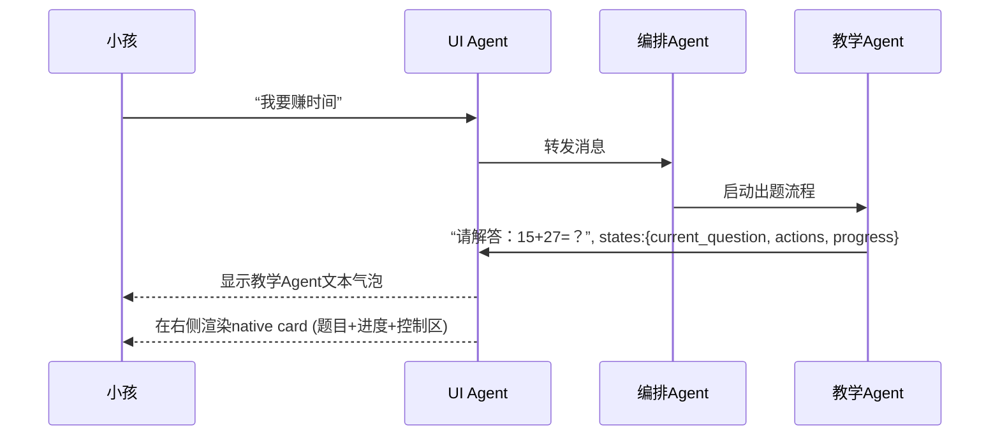

# 多Agent智能教学App架构设计文档（Chat主界面 + 右侧唯一交互Card）

---

## 1. 架构核心理念

* **所有业务Agent和UI Agent只通过自然语言（chat消息）+可选的“states”结构体通信**
* **每条对话：**

  * **文本气泡**插入到Chat窗口（可供LLM和人类审阅上下文）
  * **如需特性化交互UI**（如native card/功能区），在Chat输入框上方“Dock”显示
* **主窗口右侧永远只展示一个native card**，代表当前整个app和用户的主要互动区
  （即每次只有当前业务焦点的交互/状态被高亮）

---

## 2. 核心数据流与协议

### 2.1 消息结构

每个业务Agent和UI Agent通信采用：

```json
{
  "role": "agent/assistant/user",
  "content": "自然语言对话内容",
  "states": {
    // 仅当有结构化业务数据时填充，否则可省略
    // 由业务Agent维护
    // 例子见下
  }
}
```

### 2.2 教学Agent states范例

```json
"states": {
  "total_questions": 8,
  "correct_answers": 5,
  "wrong_answers": 3,
  "reward_time": 15,    // 单位: 分钟
  "current_question": {
    "type": "multiple_choice",
    "question": "计算 15 + 27 = ?",
    "options": ["42", "41", "43", "40"]
  },
  "actions": [
    {"type": "next", "label": "下一题"},
    {"type": "prev", "label": "上一题"},
    {"type": "finish", "label": "结束训练"}
  ]
}
```

* **这些states仅表达“当前业务Agent认为需要UI交互的内容”**，UI Agent负责自动转译为右侧native card

---

## 3. UI Agent职责

* **渲染Chat消息列表**，将所有agent、用户消息文本按时间流依次展现
* **自动判断/生成特性化UI**：每条消息如果states不为空，则：

  * 自动将states解析为对应native card结构
  * 渲染到**chat输入框上方（Dock区）**，为本条消息提供附加交互
* **右侧唯一native card渲染**：

  * 只要任一业务Agent带states，UI Agent立刻用states内容渲染唯一native card到主界面右侧
  * 该卡片永远代表app当前主要交互区（如教学答题、进度、奖励、控制按钮等）
  * 若无active业务，右侧card为空或为默认欢迎卡片

---

## 4. 典型业务流

### A. 小孩请求奖励

1. 用户在chat输入“我要赚时间”
2. UI Agent显示气泡
3. 编排Agent理解意图，调用教学Agent
4. 教学Agent回复消息+states（如新题目、历史成绩等）
5. UI Agent：

   * 插入教学Agent文本气泡
   * 用states内容渲染native card到右侧主交互区

### B. 用户答题

1. 用户在chat窗口选择“B. 42”（通过Dock区按钮/直接文本输入）
2. UI Agent将操作反馈入chat消息流
3. 编排Agent判定输入类型，转交教学Agent
4. 教学Agent处理后更新states（对错、进度、奖励等）
5. UI Agent更新chat、同步刷新右侧native card

---

## 5. UI交互原则

* **chat气泡和右侧卡片强解耦**：chat消息只负责上下文记录，native card始终单例、反映当前主业务。
* **业务Agent只需描述自己认为需要用户知道的所有状态和可交互动作**（用states表达）。
* **UI Agent自动把states转为native UI（如：进度条、选择题、奖励动画、控制区等）**，开发者无需再写UI结构。
* **所有交互事件（如按钮/表单输入）都会先通过chat气泡显式反映，再被送入编排/业务Agent链路处理，保证完整可审计和追溯。**

---

## 6. 扩展性和维护

* 新业务Agent只需维护自己的states定义和自然语言输出，无需了解UI细节。
* UI Agent可支持复杂states自动归纳、LLM/规则自动UI生成、样式适配。
* 可支持AI自动“卡片化”多种类型业务（如家长配置、时间查询、学习成就、奖励进度等）。

---

## 7. 典型交互图



---

## 8. 一句话总结

> **所有业务agent与UI agent通过“自然语言+可选业务states”通信。chat窗口承载消息历史，右侧唯一native card由UI agent根据states自动生成，代表app主交互，极致解耦，LLM与开发友好，支持持续可扩展多智能体协作。**

