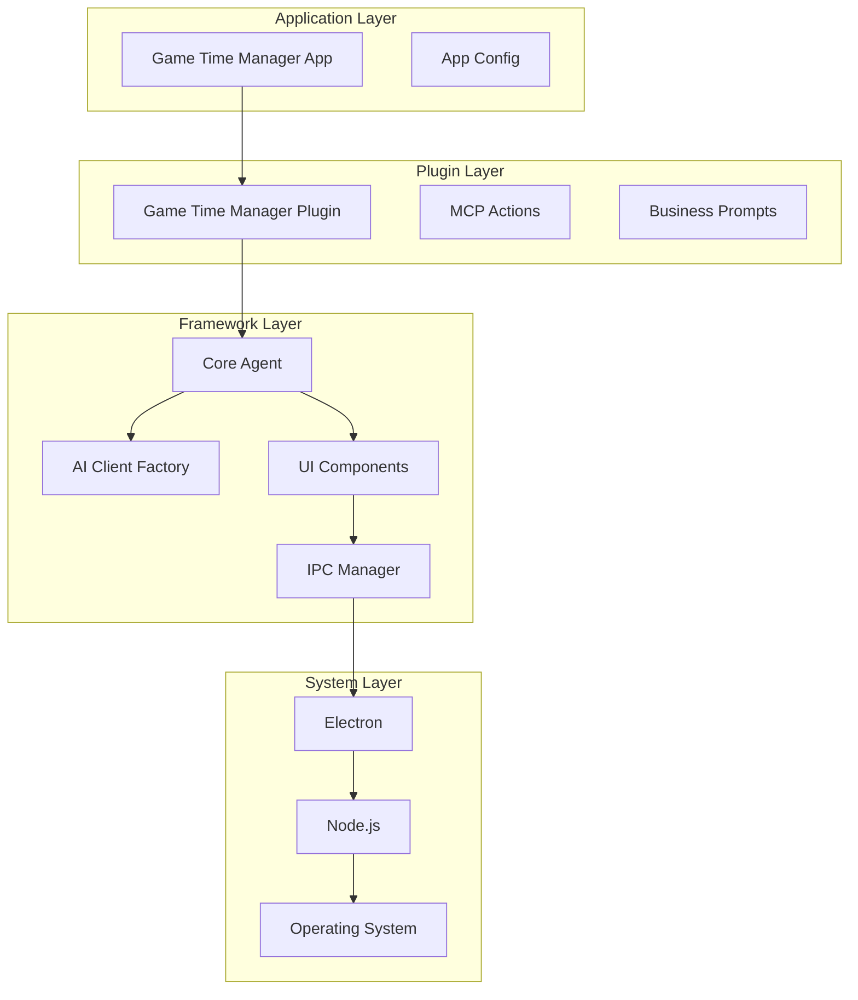

# 🏗️ Screen Control Agents 项目重构计划

## 目标

将项目彻底分离为**基础架构**和**业务逻辑**两部分，实现基础架构的开源复用。

## 📁 新目录结构

```
screencontrolagents/
├── framework/                          # 🔧 基础架构 (可开源)
│   ├── core/                          # 核心引擎
│   │   ├── app-manager.js             # 应用生命周期管理
│   │   ├── core-agent.js              # 通用AI代理引擎
│   │   ├── ai-client-factory.js       # AI客户端抽象层
│   │   ├── mcp-executor.js            # MCP执行器基类
│   │   └── logger.js                  # 日志系统
│   ├── renderer/                      # 前端框架
│   │   ├── components/                # 通用UI组件
│   │   │   ├── ChatWindow.svelte      # 通用聊天窗口
│   │   │   ├── AdaptiveCardPanel.svelte # 自适应卡片显示
│   │   │   └── BaseApp.svelte         # 应用基类
│   │   ├── stores/                    # 状态管理
│   │   │   ├── app-state.js           # 应用状态存储
│   │   │   └── plugin-state.js        # 插件状态管理
│   │   └── utils/                     # 工具函数
│   │       ├── adaptive-card-utils.js # 卡片处理工具
│   │       └── ipc-utils.js           # IPC通信工具
│   ├── config/                        # 框架配置
│   │   ├── framework-config.js        # 框架默认配置
│   │   └── base-prompt.md             # 通用系统提示词
│   ├── types/                         # TypeScript类型定义
│   │   ├── core.d.ts                  # 核心类型
│   │   ├── plugin.d.ts                # 插件接口
│   │   └── adaptive-card.d.ts         # 卡片类型
│   └── plugin-loader.js               # 插件加载器
├── plugins/                           # 🔌 业务插件目录
│   └── game-time-manager/             # 游戏时间管理插件示例
│       ├── mcp-actions/               # 具体MCP实现
│       │   ├── chrome-controller.js   # Chrome控制
│       │   ├── game-launcher.js       # 游戏启动
│       │   ├── system-monitor.js      # 系统监控
│       │   └── notification.js        # 通知系统
│       ├── prompts/                   # 业务提示词
│       │   └── business-prompt.md     # 业务逻辑提示词
│       ├── config/                    # 业务配置
│       │   └── plugin-config.js       # 插件特定配置
│       ├── ui/                        # 插件特定UI组件
│       │   └── GameStatusCard.svelte  # 游戏状态卡片
│       └── plugin.js                  # 插件入口点
├── apps/                              # 🚀 应用实例
│   └── game-time-manager/             # 具体应用实例
│       ├── main.js                    # 应用主入口
│       ├── renderer/                  # 应用渲染器
│       │   └── App.svelte             # 应用根组件
│       ├── config/                    # 应用配置
│       │   └── app-config.js          # 应用特定配置
│       └── package.json               # 应用依赖
├── examples/                          # 📚 示例应用
│   ├── basic-chat-app/                # 基础聊天应用示例
│   └── task-automation/               # 任务自动化示例
└── package.json                       # 框架依赖
```

## 🔧 基础架构组件

### 1. 核心引擎 (framework/core/)

#### AppManager (app-manager.js)

- Electron 应用生命周期管理
- 插件加载和初始化
- IPC 通信设置
- 窗口管理

#### CoreAgent (core-agent.js)

- AI 代理核心引擎
- 状态管理抽象
- 提示词注入机制
- 响应解析框架

#### AIClientFactory (ai-client-factory.js)

- 多 LLM 服务支持
- 统一 API 接口
- 流式响应处理
- 错误处理和重试

#### MCPExecutor (mcp-executor.js)

- MCP 动作执行基类
- 权限验证框架
- 参数验证机制
- 插件动作注册

### 2. 前端框架 (framework/renderer/)

#### 通用组件

- **ChatWindow**: 聊天界面框架
- **AdaptiveCardPanel**: 自适应卡片渲染器
- **BaseApp**: 应用基础布局

#### 状态管理

- 应用全局状态
- 插件状态隔离
- 响应式更新机制

### 3. 插件系统

#### 插件接口规范

```javascript
// Plugin Interface
class Plugin {
  constructor(framework) {
    this.framework = framework;
  }

  // 插件初始化
  async initialize() {}

  // 注册MCP动作
  registerMCPActions() {
    return {
      action_name: this.handleAction.bind(this)
    };
  }

  // 提供业务提示词
  getBusinessPrompt() {
    return fs.readFileSync('business-prompt.md', 'utf8');
  }

  // 插件特定配置
  getConfig() {
    return require('./config/plugin-config.js');
  }
}
```

## 🔌 业务插件示例 (plugins/game-time-manager/)

### MCP 动作实现

- `launch_game`: 游戏启动逻辑
- `monitor_game_process`: 进程监控
- `close_game`: 游戏关闭
- `send_notification`: 通知发送
- `chrome_control`: Chrome 控制

### 业务配置

- 游戏时间配额规则
- 权限管理设置
- 答题系统配置
- 家长控制功能

## 🚀 应用实例 (apps/game-time-manager/)

### 应用入口 (main.js)

```javascript
const { Framework } = require('../../framework');
const GameTimeManagerPlugin = require('../../plugins/game-time-manager/plugin.js');

async function createApp() {
  const framework = new Framework({
    window: { width: 1200, height: 800 },
    plugins: [GameTimeManagerPlugin]
  });

  await framework.initialize();
  return framework;
}

app.whenReady().then(createApp);
```

### 应用配置

- 特定的 AI 模型选择
- 用户界面定制
- 数据存储位置
- 外部服务集成

## 📋 迁移步骤

### 阶段 1: 创建框架结构

1. ✅ 创建新目录结构
2. ✅ 提取通用组件到 framework/
3. ✅ 创建插件加载器
4. ✅ 定义插件接口

### 阶段 2: 重构核心组件

1. ✅ 重构 AppManager
2. ✅ 抽象 CoreAgent
3. ✅ 移动 AIClientFactory
4. ✅ 创建 MCPExecutor 基类

### 阶段 3: 创建业务插件

1. ✅ 提取游戏控制逻辑
2. ✅ 分离业务提示词
3. ✅ 重构 MCP 动作
4. ✅ 创建插件配置

### 阶段 4: 构建应用实例

1. ✅ 创建应用入口
2. ✅ 集成插件系统
3. ✅ 测试完整功能
4. ✅ 优化性能

### 阶段 5: 文档和示例

1. ✅ 编写框架文档
2. ✅ 创建示例应用
3. ✅ 插件开发指南
4. ✅ API 参考文档

## 🎯 预期收益

### 对于框架开发者

- **可复用性**: 基础架构可用于多种应用场景
- **可维护性**: 清晰的代码分离和模块化
- **可扩展性**: 插件系统支持功能扩展
- **开源友好**: 框架部分可以开源共享

### 对于应用开发者

- **快速开发**: 基于框架快速构建 AI 应用
- **标准化**: 统一的开发模式和最佳实践
- **专注业务**: 专注于业务逻辑而非基础设施
- **社区支持**: 共享插件和组件生态

### 对于最终用户

- **更好体验**: 专业的 UI 和交互设计
- **更高稳定性**: 经过充分测试的基础架构
- **更强功能**: 丰富的插件生态系统
- **更好性能**: 优化的核心引擎

## 🔗 技术架构图



这个重构方案将创建一个强大、灵活且可复用的 AI 应用开发框架，同时保持业务逻辑的清
晰分离。
